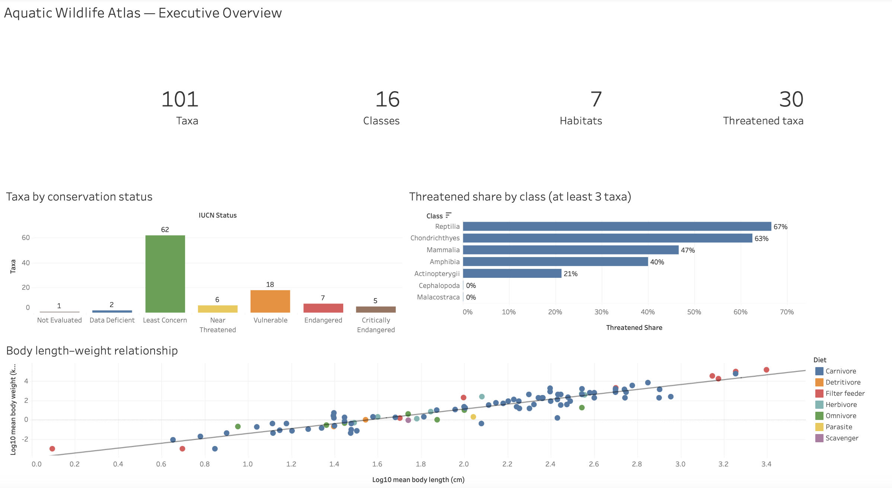
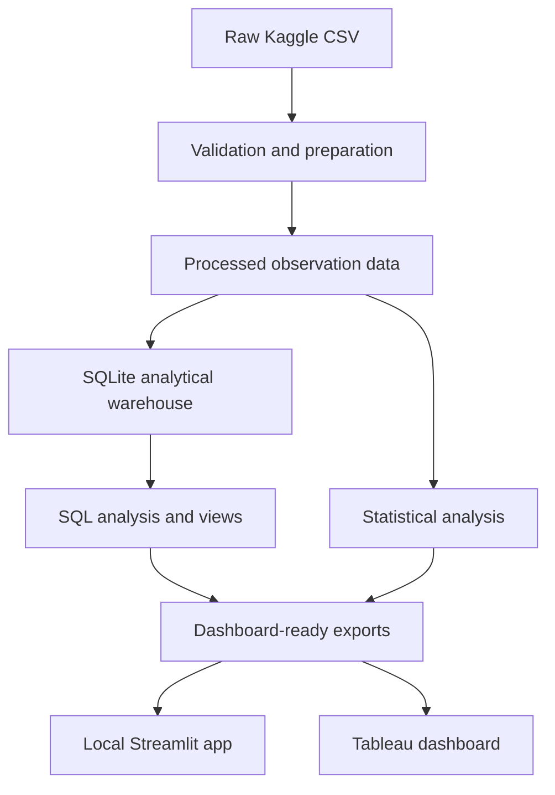
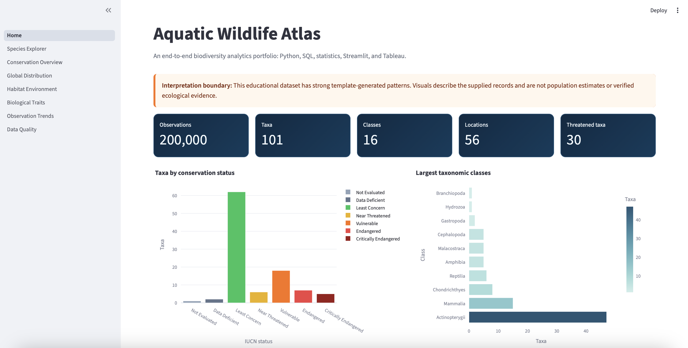
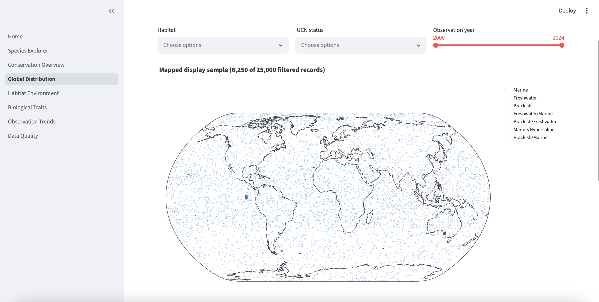
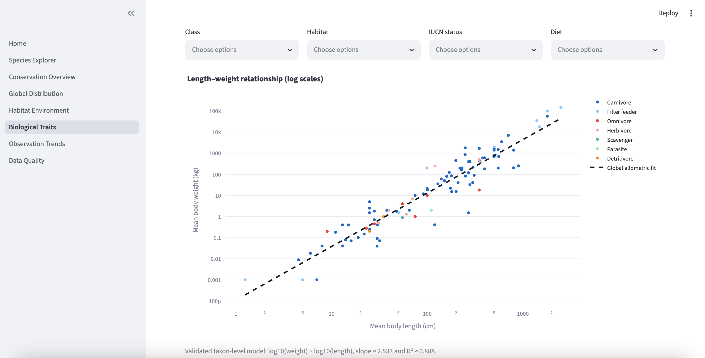
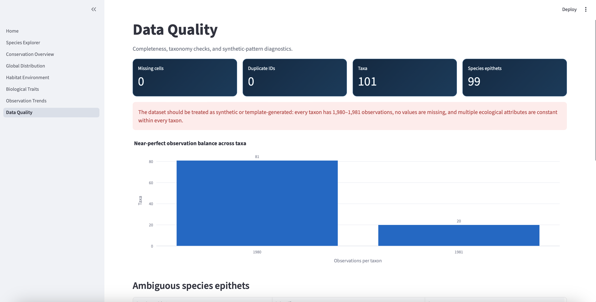

# Aquatic Wildlife Atlas

An end-to-end biodiversity analytics portfolio built with Python, SQL, statistics, Streamlit, and Tableau.

[](https://www.python.org/)
[](https://streamlit.io/)
[](https://public.tableau.com/app/profile/pontus.bj.rkell/viz/AquaticWildlifeAtlas/AquaticWildlifeAtlasExecutiveOverview)
[](https://www.sqlite.org/)

> [!IMPORTANT]
> **The Streamlit application is not hosted online. It must be opened locally from this repository.**
>
> After installing the project, run:
>
> ```bash
> python -m streamlit run dashboard/streamlit/Home.py
> ```
>
> The Tableau dashboard is available online through Tableau Public.

## Quick links

| Resource | Link |
|---|---|
| Tableau dashboard | [Open the Aquatic Wildlife Atlas Executive Overview](https://public.tableau.com/app/profile/pontus.bj.rkell/viz/AquaticWildlifeAtlas/AquaticWildlifeAtlasExecutiveOverview) |
| Source dataset | [Aquatic Wildlife Atlas: Global Species Records on Kaggle](https://www.kaggle.com/datasets/maulikgajera/aquatic-wildlife-atlas-global-species-records) |
| Streamlit application | Local only - see [Running the Streamlit dashboard](#running-the-streamlit-dashboard) |
| Repository | [PontusBjorkell/Aquatic-Wildlife-Atlas](https://github.com/PontusBjorkell/Aquatic-Wildlife-Atlas) |

## Tableau dashboard

[](https://public.tableau.com/app/profile/pontus.bj.rkell/viz/AquaticWildlifeAtlas/AquaticWildlifeAtlasExecutiveOverview)

The Tableau executive overview presents four headline indicators, conservation-status composition, threatened share by sufficiently represented taxonomic class, and the fitted body length-weight relationship.

## Project overview

Aquatic Wildlife Atlas turns a 200,000-row aquatic-species dataset into a reproducible analytical project. It covers the complete workflow from validation and data preparation to a SQLite analytical warehouse, SQL analysis, statistical modelling, dashboard exports, and two presentation layers:

- An interactive, seven-page Streamlit application for detailed exploration.
- A Tableau Public executive dashboard for a concise portfolio overview.

The project is intended to demonstrate practical data-engineering, analytics, statistical, visualization, and communication skills within one repository.

### Dataset snapshot

| Metric | Value |
|---|---:|
| Observation records | 200,000 |
| Full scientific-name taxa | 101 |
| Taxonomic classes | 16 |
| Habitat types | 7 |
| Named locations | 56 |
| Threatened taxa | 30 |

In this project, **threatened** comprises taxa labelled Vulnerable, Endangered, or Critically Endangered.

## Analytical workflow



The command-line scripts make each stage reproducible:

1. `prepare_data.py` validates, cleans, types, and enriches the raw data.
2. `build_database.py` creates the SQLite warehouse and analytical views.
3. `run_analysis.py` runs the SQL and Python analyses.
4. `run_statistical_analysis.py` produces statistical results and reports.
5. `export_dashboard_data.py` creates compact dashboard-ready datasets.

## Streamlit application

The Streamlit interface is the detailed exploration layer. It includes shared filters, KPI cards, interactive Plotly visualizations, tables, explanatory messages, and downloadable filtered data.

| Page | Purpose |
|---|---|
| **Home** | Dataset overview, headline KPIs, conservation composition, largest classes, and annual coverage. |
| **Species Explorer** | Filter taxa by class, habitat, IUCN status, and diet; compare morphology and inspect an individual species profile. |
| **Conservation Overview** | Explore status composition, threatened share by class, and the taxa in threatened categories. |
| **Global Distribution** | Inspect a deterministic coordinate sample with habitat, status, and observation-year filters. |
| **Habitat & Environment** | Compare depth, temperature, salinity, pH, habitat composition, and biome-level summaries. |
| **Biological Traits** | Explore morphology, diet, longevity, and the allometric body length-weight relationship. |
| **Observation Trends** | Examine complete-year, monthly, and observation-method record composition. |
| **Data Quality** | Review completeness, duplicate IDs, taxonomic ambiguity, record balance, and coordinate-dispersion diagnostics. |

### Running the Streamlit dashboard

There is currently **no hosted Streamlit URL**. Run the application from the repository root:

```bash
python -m streamlit run dashboard/streamlit/Home.py
```

Streamlit will normally open the application automatically. If it does not, open the local address shown in the terminal, usually:

```text
http://localhost:8501
```

Stop the server with `Ctrl+C`.

## Streamlit gallery

### Home



<details>
<summary><strong>Global Distribution</strong></summary>



</details>

<details>
<summary><strong>Biological Traits</strong></summary>



</details>

<details>
<summary><strong>Data Quality</strong></summary>



</details>

## Statistical analysis

The statistical workflow operates primarily at the taxon level to avoid treating thousands of repeated observations of the same taxon as independent biological measurements.

Included analyses cover:

- Descriptive taxon-level statistics.
- Pairwise Spearman correlations with p-values.
- Kruskal-Wallis comparisons across habitat groups.
- Categorical association analysis.
- Comparisons between threatened and non-threatened groups.
- Allometric regression of body weight on body length.

The principal allometric model is:

$$
\log_{10}(\text{weight}) =
\beta_0 + \beta_1\log_{10}(\text{length}) + \varepsilon
$$

The supplied data produces an approximate slope of **2.533**, with **R&sup2; &asymp; 0.888** and **p < 0.0001**. Here, "log-log" means that both variables are transformed with base-10 logarithms before fitting the linear model; it does not mean taking the logarithm twice.

Machine-readable results and a written statistical report are stored under `reports/statistical/`.

## SQL and data warehouse

The project uses SQLite as a lightweight analytical warehouse. SQL assets are separated from application code:

- `sql/create_schema.sql` defines the warehouse tables and constraints.
- `sql/create_views.sql` defines reusable analytical views.
- `sql/analysis_queries.sql` contains the portfolio analysis queries.

The database layer in `src/aquatic_wildlife/database.py` executes the schema and view definitions and loads the prepared records. Generated database files are excluded from Git because they can be rebuilt from the source data.

## Repository structure

```text
Aquatic-Wildlife-Atlas/
|-- dashboard/
|   `-- streamlit/
|       |-- Home.py
|       |-- utils.py
|       `-- pages/
|           |-- 1_Species_Explorer.py
|           |-- 2_Conservation_Overview.py
|           |-- 3_Global_Distribution.py
|           |-- 4_Habitat_Environment.py
|           |-- 5_Biological_Traits.py
|           |-- 6_Observation_Trends.py
|           `-- 7_Data_Quality.py
|-- data/
|   |-- raw/                 # Original Kaggle CSV; not committed
|   |-- processed/           # Prepared data and quality report
|   |-- database/            # Generated SQLite warehouse
|   |-- analysis_results/    # Generated analytical outputs
|   `-- dashboard/           # Dashboard-ready extracts
|-- images/
|   |-- streamlit/
|   `-- tableau/
|-- reports/
|   |-- figures/
|   |-- sql/
|   `-- statistical/
|-- scripts/
|   |-- prepare_data.py
|   |-- build_database.py
|   |-- run_analysis.py
|   |-- run_statistical_analysis.py
|   `-- export_dashboard_data.py
|-- sql/
|   |-- create_schema.sql
|   |-- create_views.sql
|   `-- analysis_queries.sql
|-- src/
|   `-- aquatic_wildlife/
|       |-- config.py
|       |-- data.py
|       |-- validation.py
|       |-- database.py
|       |-- analysis.py
|       |-- statistics.py
|       `-- dashboard.py
|-- tableau/
|   |-- aquatic_wildlife_dashboard.twb
|   `-- aquatic_wildlife_dashboard.twbx
|-- tests/
|-- .gitignore
|-- pyproject.toml
|-- requirements.txt
`-- README.md
```

## Technology stack

| Area | Technology |
|---|---|
| Data preparation | Python, pandas, NumPy |
| Validation | Custom validation and quality-report pipeline |
| Data warehouse | SQLite, SQL |
| Statistical analysis | SciPy and statsmodels/scientific Python tooling |
| Interactive visualization | Streamlit and Plotly |
| Executive visualization | Tableau Public |
| Testing | pytest |
| Packaging | `pyproject.toml` with a `src/` layout |

## Installation

### 1. Clone the repository

```bash
git clone https://github.com/PontusBjorkell/Aquatic-Wildlife-Atlas.git
cd Aquatic-Wildlife-Atlas
```

### 2. Create and activate a virtual environment

macOS or Linux:

```bash
python3 -m venv .venv
source .venv/bin/activate
```

Windows PowerShell:

```powershell
py -m venv .venv
.\.venv\Scripts\Activate.ps1
```

### 3. Install the project

```bash
python -m pip install --upgrade pip
pip install -e .
```

If editable installation is not desired, install the pinned application dependencies directly:

```bash
pip install -r requirements.txt
```

## Rebuilding the project from the raw data

1. Download the CSV from the [Kaggle dataset page](https://www.kaggle.com/datasets/maulikgajera/aquatic-wildlife-atlas-global-species-records).
2. Place the source CSV in `data/raw/`.
3. From the repository root, run the pipeline in order:

```bash
python scripts/prepare_data.py
python scripts/build_database.py
python scripts/run_analysis.py
python scripts/run_statistical_analysis.py
python scripts/export_dashboard_data.py
```

Then start Streamlit:

```bash
python -m streamlit run dashboard/streamlit/Home.py
```

Generated datasets, reports, and the SQLite database are excluded selectively through `.gitignore` where they can be reproduced. Compact dashboard extracts and selected statistical outputs may be retained when they are needed to run or document the portfolio.

## Tests

Run the complete test suite from the repository root:

```bash
pytest
```

For more detailed output:

```bash
pytest -v
```

The tests cover data preparation, validation, warehouse construction, analytics, statistics, and dashboard-export behavior.

## Tableau workbook

The repository contains Tableau workbook files under `tableau/`:

- `aquatic_wildlife_dashboard.twb` - unpackaged workbook definition.
- `aquatic_wildlife_dashboard.twbx` - packaged workbook.

The published dashboard is available here:

**[Aquatic Wildlife Atlas - Executive Overview on Tableau Public](https://public.tableau.com/app/profile/pontus.bj.rkell/viz/AquaticWildlifeAtlas/AquaticWildlifeAtlasExecutiveOverview)**

The dashboard intentionally summarizes the project rather than duplicating every Streamlit page. Detailed filtering, species profiles, environmental exploration, observation trends, and the full data-quality investigation remain in the local Streamlit application.

## Data-quality and interpretation boundary

> [!CAUTION]
> This dataset should be treated as **synthetic or template-generated educational data**, not as verified ecological occurrence evidence.

The project's validation and exploratory analysis identified several strong procedural patterns:

- Every taxon has almost exactly the same number of records: 1,980 or 1,981.
- The dataset contains no missing cells.
- Observation-method and complete-year counts are unusually uniform.
- Several ecological and biological fields are constant within each taxon.
- Named locations and geographic coordinates are not consistently aligned.
- Some named locations span implausibly broad latitude and longitude ranges.
- The final year, 2024, is partial and is excluded from complete-year trend comparisons.

Consequently:

- Maps are data-quality diagnostics, not verified species-occurrence maps.
- Record totals must not be interpreted as population size or abundance.
- Conservation summaries describe the supplied taxon records only.
- Statistical associations demonstrate analytical methods but should not be presented as new ecological evidence.

These limitations are surfaced directly in the Streamlit application rather than hidden from the viewer.

## Design decisions

- **Scientific names are the taxon key.** Species epithets alone are not unique; for example, the same epithet can occur in different genera.
- **Taxon-level summaries reduce pseudo-replication.** Repeated observation rows are aggregated before biological-trait modelling.
- **Threatened-share charts use a minimum class size.** Classes with fewer than three represented taxa are excluded from the headline comparison to avoid emphasizing unstable percentages.
- **The partial year is handled explicitly.** Annual trend charts use complete years through 2023 and label 2024 separately.
- **Dashboard extracts are compact.** Streamlit loads purpose-built CSV exports rather than repeatedly querying or aggregating all 200,000 rows.

## Reproducibility notes

- Run commands from the repository root so that project-relative paths resolve correctly.
- Keep the virtual environment outside version control.
- Do not commit the raw Kaggle dataset unless its license and distribution terms permit it.
- Re-run the export script after changing preparation, SQL, or statistical logic.
- When publishing a new Tableau version, package its data source or update the workbook connection before replacing the `.twb`/`.twbx` files.

## Data source and attribution

The analysis uses the Kaggle dataset:

**[Aquatic Wildlife Atlas: Global Species Records](https://www.kaggle.com/datasets/maulikgajera/aquatic-wildlife-atlas-global-species-records)** by Maulik Gajera.

Please consult the Kaggle page for the dataset's current description, provenance, license, and redistribution terms. The source CSV is intentionally not required to be committed to this repository.

## Author

Created by **Pontus Bj&ouml;rkell** as a data analytics and visualization portfolio project.

- [GitHub profile](https://github.com/PontusBjorkell)
- [Tableau Public profile](https://public.tableau.com/app/profile/pontus.bj.rkell)

---

If you want the full interactive exploration, clone the repository and run Streamlit locally. For a browser-based executive summary, use the Tableau Public dashboard linked above.
